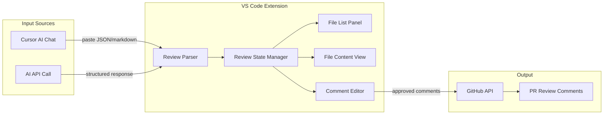

# PR Review Assistant - VS Code Extension

A VS Code extension that provides an interactive UI for reviewing AI-generated PR comments, with the ability to confirm/reject/edit each finding and submit them to GitHub in one action.

---

## Problem Statement

Reviewing PRs with AI assistance is currently a multi-step manual process:
1. Fetch the branch and generate a diff
2. Paste into an AI chat with a review template
3. Read through the AI's findings
4. Manually copy each relevant comment to GitHub PR

This extension automates steps 3-4 by providing an interactive UI where you can review, edit, and batch-submit comments.

---

## Architecture



---

## UI Design

### Layout

```
+---------------------------+----------------------------------------+
|  Files with Findings      |  File Content                          |
|  -----------------------  |  --------------------------------------  |
|  [x] src/utils/api.ts (3) |  1  | import { fetch } from 'node-fetch' |
|  [ ] src/hooks/useAuth.ts |  2  |                                    |
|  [x] src/App.tsx (1)      |  3  | export async function getData() {  |
|                           |  4  |   const res = await fetch(url);    |
|                           |      +----------------------------------+ |
|                           |      | Line 4: Missing error handling   | |
|                           |      | Suggestion: Wrap in try/catch    | |
|                           |      | [Confirm] [Edit] [Reject]        | |
|                           |      +----------------------------------+ |
|                           |  5  |   return res.json();               |
|  [Submit PR Comments]     |  6  | }                                  |
+---------------------------+----------------------------------------+
```

### Panels

1. **Left Panel - File List**
   - Shows all files with findings
   - Badge with finding count per file
   - Checkbox to select/deselect all findings in a file
   - "Submit PR Comments" button at bottom

2. **Right Panel - File Viewer**
   - Shows file content with line numbers
   - Inline comment cards appear below relevant lines
   - Each card shows: issue description, suggested fix, severity
   - Action buttons: Confirm, Edit, Reject

3. **Comment Card States**
   - Pending (default) - gray border
   - Approved - green border/checkmark
   - Rejected - red border/strikethrough
   - Edited - blue border with "edited" badge

---

## Core Components

### 1. Review Parser (`src/parser.ts`)

Accepts AI output in two formats:

**Structured JSON** (when calling API directly):
```json
{
  "findings": [
    {
      "file": "src/utils/api.ts",
      "line": 4,
      "severity": "high",
      "issue": "Missing error handling",
      "suggestion": "Wrap fetch call in try/catch block"
    }
  ]
}
```

**Markdown** (when pasting from Cursor chat):
```markdown
**File:** `src/utils/api.ts` (line 4)
**Issue:** Missing error handling
**Suggestion:** Wrap fetch call in try/catch block
```

Parser uses regex patterns to extract file, line, issue, and suggestion from markdown format.

### 2. State Manager (`src/state.ts`)

```typescript
interface Finding {
  id: string;
  file: string;
  line: number;
  severity: 'critical' | 'high' | 'medium' | 'low';
  issue: string;
  suggestion?: string;
  status: 'pending' | 'approved' | 'rejected';
  editedComment?: string;
}

interface ReviewState {
  prNumber: number;
  repoOwner: string;
  repoName: string;
  findings: Finding[];
  selectedFile: string | null;
}
```

### 3. Webview Panel (`src/webview/`)

React-based UI with:
- `FileList.tsx` - left sidebar component
- `FileViewer.tsx` - main content area with code display
- `CommentCard.tsx` - inline comment component with actions

Communication between extension and webview via `postMessage` API.

### 4. GitHub Integration (`src/github.ts`)

Two options:

**Option A: GitHub CLI (`gh`)**
```typescript
import { exec } from 'child_process';

async function submitReview(prNumber: number, comments: Comment[]) {
  // Create review with line comments using gh api
  const body = JSON.stringify({
    body: "AI-assisted review",
    event: "COMMENT",
    comments: comments.map(c => ({
      path: c.file,
      line: c.line,
      body: c.body
    }))
  });
  
  exec(`gh api repos/{owner}/{repo}/pulls/${prNumber}/reviews -X POST -f '${body}'`);
}
```

**Option B: Octokit**
```typescript
import { Octokit } from '@octokit/rest';

const octokit = new Octokit({ auth: token });

await octokit.pulls.createReview({
  owner,
  repo,
  pull_number: prNumber,
  event: 'COMMENT',
  comments: approvedFindings.map(f => ({
    path: f.file,
    line: f.line,
    body: f.editedComment || `**${f.issue}**\n\n${f.suggestion || ''}`
  }))
});
```

---

## Extension Commands

| Command | ID | Description |
|---------|-----|-------------|
| PR Review: Start Review | `prReview.start` | Opens panel, prompts for PR number |
| PR Review: Import from Clipboard | `prReview.import` | Parses clipboard content as AI output |
| PR Review: Call AI API | `prReview.callAI` | Fetches diff, calls AI, populates findings |
| PR Review: Submit Comments | `prReview.submit` | Posts approved comments to GitHub |

---

## Configuration Settings

```json
{
  "prReview.aiProvider": {
    "type": "string",
    "enum": ["anthropic", "openai", "none"],
    "default": "none",
    "description": "AI provider for direct API calls (or 'none' to paste manually)"
  },
  "prReview.anthropicApiKey": {
    "type": "string",
    "description": "Anthropic API key (stored securely)"
  },
  "prReview.openaiApiKey": {
    "type": "string",
    "description": "OpenAI API key (stored securely)"
  },
  "prReview.githubAuth": {
    "type": "string",
    "enum": ["gh-cli", "token"],
    "default": "gh-cli",
    "description": "GitHub authentication method"
  },
  "prReview.reviewTemplate": {
    "type": "string",
    "description": "Path to custom review template (optional)"
  }
}
```

---

## User Workflows

### Workflow A: Paste from Cursor AI

1. Run `node docs/pr-review-prepare.mjs <branch> --copy` in terminal
2. Paste into Cursor chat, get AI review output
3. Copy AI response to clipboard
4. Run command: `PR Review: Start Review`
5. Enter PR number when prompted
6. Run command: `PR Review: Import from Clipboard`
7. Review findings in the panel, confirm/edit/reject each
8. Click "Submit PR Comments"

### Workflow B: Direct AI API

1. Configure API key in extension settings
2. Run command: `PR Review: Start Review`
3. Enter PR number when prompted
4. Run command: `PR Review: Call AI API`
5. Extension fetches diff, calls AI, populates panel
6. Review findings, confirm/edit/reject each
7. Click "Submit PR Comments"

---

## File Structure

```
pr-review-assistant/
├── .vscode/
│   └── launch.json              # Debug configuration
├── src/
│   ├── extension.ts             # Entry point, command registration
│   ├── parser.ts                # AI output parser (JSON + markdown)
│   ├── state.ts                 # Review state management
│   ├── github.ts                # GitHub API integration
│   ├── ai.ts                    # AI API clients (Anthropic/OpenAI)
│   └── webview/
│       ├── panel.ts             # Webview panel setup
│       ├── app.tsx              # React app entry
│       ├── components/
│       │   ├── FileList.tsx     # Left sidebar
│       │   ├── FileViewer.tsx   # Code display with inline comments
│       │   └── CommentCard.tsx  # Individual comment with actions
│       └── styles/
│           └── main.css         # Tailwind or custom styles
├── resources/
│   └── icon.png                 # Extension icon
├── package.json                 # Extension manifest
├── tsconfig.json
├── webpack.config.js            # Bundle extension + webview
└── README.md
```

---

## Package.json (Extension Manifest)

```json
{
  "name": "pr-review-assistant",
  "displayName": "PR Review Assistant",
  "description": "Interactive AI-assisted PR review with GitHub integration",
  "version": "0.1.0",
  "engines": {
    "vscode": "^1.85.0"
  },
  "categories": ["Other"],
  "activationEvents": [],
  "main": "./dist/extension.js",
  "contributes": {
    "commands": [
      {
        "command": "prReview.start",
        "title": "PR Review: Start Review"
      },
      {
        "command": "prReview.import",
        "title": "PR Review: Import from Clipboard"
      },
      {
        "command": "prReview.callAI",
        "title": "PR Review: Call AI API"
      },
      {
        "command": "prReview.submit",
        "title": "PR Review: Submit Comments"
      }
    ],
    "configuration": {
      "title": "PR Review Assistant",
      "properties": {
        "prReview.aiProvider": {
          "type": "string",
          "enum": ["anthropic", "openai", "none"],
          "default": "none"
        },
        "prReview.githubAuth": {
          "type": "string",
          "enum": ["gh-cli", "token"],
          "default": "gh-cli"
        }
      }
    }
  },
  "scripts": {
    "vscode:prepublish": "npm run build",
    "build": "webpack --mode production",
    "watch": "webpack --mode development --watch",
    "lint": "eslint src"
  },
  "devDependencies": {
    "@types/node": "^20.0.0",
    "@types/vscode": "^1.85.0",
    "@types/react": "^18.2.0",
    "@types/react-dom": "^18.2.0",
    "typescript": "^5.3.0",
    "webpack": "^5.89.0",
    "webpack-cli": "^5.1.0",
    "ts-loader": "^9.5.0",
    "css-loader": "^6.8.0",
    "style-loader": "^3.3.0"
  },
  "dependencies": {
    "@octokit/rest": "^20.0.0",
    "react": "^18.2.0",
    "react-dom": "^18.2.0",
    "@anthropic-ai/sdk": "^0.10.0",
    "openai": "^4.20.0"
  }
}
```

---

## Implementation Tasks

### Phase 1: Scaffolding
- [ ] Initialize VS Code extension with `yo code`
- [ ] Set up TypeScript + webpack configuration
- [ ] Create basic webview panel that opens on command
- [ ] Set up React in webview with hot reload for development

### Phase 2: Parser + State
- [ ] Implement JSON parser for structured AI output
- [ ] Implement markdown parser with regex patterns
- [ ] Create state manager with Finding interface
- [ ] Add state persistence (optional, for session recovery)

### Phase 3: Webview UI
- [ ] Build FileList component with finding counts
- [ ] Build FileViewer with line numbers and code highlighting
- [ ] Build CommentCard with Confirm/Edit/Reject actions
- [ ] Implement webview <-> extension message passing
- [ ] Add keyboard shortcuts (Enter to confirm, Escape to reject)

### Phase 4: GitHub Integration
- [ ] Implement `gh` CLI wrapper for posting reviews
- [ ] Implement Octokit alternative for token-based auth
- [ ] Add PR number detection from current branch
- [ ] Handle API errors gracefully with user feedback

### Phase 5: AI Integration (Optional)
- [ ] Add Anthropic API client
- [ ] Add OpenAI API client
- [ ] Implement diff fetching via `gh pr diff`
- [ ] Bundle review template with extension

### Phase 6: Polish
- [ ] Add extension icon and branding
- [ ] Write README with screenshots
- [ ] Add telemetry opt-in (optional)
- [ ] Publish to VS Code marketplace (or keep private)

---

## Estimated Effort

| Component | Lines of Code | Effort |
|-----------|---------------|--------|
| Extension scaffolding | ~100 | Small |
| Parser (JSON + markdown) | ~200 | Small |
| State manager | ~150 | Small |
| Webview UI (React) | ~500 | Medium |
| GitHub integration | ~150 | Small |
| AI integration | ~200 | Small |
| **Total** | **~1300** | **Medium** |

---

## Future Enhancements

- **Batch operations**: Select multiple findings and approve/reject all
- **Severity filters**: Show only critical/high findings
- **Diff view**: Show the actual diff instead of full file content
- **Comment templates**: Pre-defined comment formats for common issues
- **Review history**: Track past reviews for reference
- **Team sharing**: Share review templates across team members
