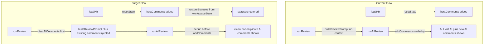

# AI Review Context Awareness

---

## File Roles (Read This First)

This implementation uses **three coordinated files**. Each has a specific purpose:

| File | Purpose | When to Use |
|------|---------|-------------|
| **[ai-review-context-plan.md](ai-review-context-plan.md)** (THIS FILE) | Master plan with detailed specifications | Reference for implementation details, code snippets, and requirements |
| **[ai-review-context-tasks.md](ai-review-context-tasks.md)** | Task checklist with completion status | Check/update task progress, see what's done vs pending |
| **[ai-review-context-summary.md](ai-review-context-summary.md)** | Running summary of completed work | **READ BEFORE EACH TASK** to understand prior context |

### For AI Agents: Mandatory Workflow

**BEFORE starting ANY task:**
1. **READ** [ai-review-context-summary.md](ai-review-context-summary.md) completely - understand what was done before
2. **CHECK** [ai-review-context-tasks.md](ai-review-context-tasks.md) - verify current task status
3. **REFERENCE** this plan file for implementation details

**DURING each task:**
- Follow the code snippets and specifications in THIS file
- Run tests frequently: `npm test`
- Create a new branch for the task before implementing

**AFTER completing each task:**
1. Run `npm run build` - must pass
2. Run `npm test` - all tests must pass
3. Run `npm run package` - must create .vsix
4. **UPDATE** [ai-review-context-tasks.md](ai-review-context-tasks.md) - check off ALL items for the task
5. **UPDATE** [ai-review-context-summary.md](ai-review-context-summary.md) - add detailed summary
6. Follow version rules (bump version, README, CHANGELOG) before committing
7. Commit all changes (including both tracking files) following project conventions

---

## Problem Summary

When a user reloads a PR and reruns the AI:

1. Host comments (the submitted review) reappear as `source: 'host'`
2. The AI knows nothing about them → re-raises the same issues
3. Old AI comments from the previous session remain in state → duplicates pile up
4. Local approval statuses (`approved`/`rejected`) are lost on reload

## Data Flow (Current vs Target)



## Key Files

- [src/extension.ts](src/extension.ts) — `runReview()` (line ~774), `loadPR()` (line ~626)
- [src/review-template.ts](src/review-template.ts) — `buildReviewPrompt()`, `REVIEW_TEMPLATE`
- [src/state.ts](src/state.ts) — `addComments()`, `resetState()`, `getAllComments()`
- [src/types.ts](src/types.ts) — `ReviewComment`, `CommentStatus`
- [src/ai-providers.ts](src/ai-providers.ts) — `runAIReview()`, `parseAIResponse()`

---

## Task 1: Inject Existing Host Comments into AI Prompt

**Branch:** `task/1-inject-host-comments-into-prompt`

**Goal:** Pass existing host comments to `buildReviewPrompt` so the AI knows what's already been filed and focuses only on new/unaddressed issues.

### Changes

**File: `src/review-template.ts`**

Add an optional `existingComments` parameter to `buildReviewPrompt`:

```typescript
export async function buildReviewPrompt(
  headBranch: string,
  baseBranch: string,
  prTitle: string,
  _diff: string,
  projectContext: ProjectContext,
  workspaceRoot?: string | null,
  existingComments?: ReviewComment[]   // NEW
): Promise<string>
```

Before the `## Code Changes` section, append a new section when host comments exist:

```typescript
const existingSection =
  existingComments && existingComments.length > 0
    ? `\n---\n\n## Already Filed Comments\n\nThe following issues have already been raised on this PR. Do NOT repeat them. Focus only on issues not yet covered.\n\n${existingComments
        .map((c) => `- **${c.file}:${c.line}** — ${c.issue}`)
        .join("\n")}\n`
    : "";
```

Insert `existingSection` into the returned template string just before `## Code Changes`.

**File: `src/extension.ts`** — in `runReview()`:

```typescript
import { getAllComments } from "./state";

// Before buildReviewPrompt call:
const hostComments = getAllComments().filter((c) => c.source === "host");

const template = await buildReviewPrompt(
  state.pr!.headBranch,
  state.pr!.baseBranch,
  state.pr!.title,
  state.diff,
  projectContext,
  projectContext.rootPath,
  hostComments   // NEW — pass host comments
);
```

### Tests

**File: `src/review-template.test.ts`** (extend existing)

- `buildReviewPrompt` with no existing comments → no "Already Filed Comments" section
- `buildReviewPrompt` with host comments → section present, each comment listed as `file:line — issue`
- Section is placed before `## Code Changes`

### Definition of Done

- `buildReviewPrompt` accepts optional `existingComments: ReviewComment[]`
- When host comments exist, prompt includes "Already Filed Comments" section
- `runReview()` passes current host comments to `buildReviewPrompt`
- Tests pass
- Build, test, package

---

## Task 2: Deduplicate AI Comments Before Adding

**Branch:** `task/2-dedup-ai-comments`

**Goal:** Filter out AI findings that target the same `file + line` as any already-existing comment (host or AI) before calling `addComments`.

### Changes

**File: `src/state.ts`**

Add a new exported function:

```typescript
/**
 * Filter comments that duplicate an existing comment at the same file+line.
 * A duplicate is defined as: same file path AND line number within ±1 line tolerance.
 */
export function deduplicateComments(
  incoming: ReviewComment[],
  existing: ReviewComment[]
): ReviewComment[] {
  return incoming.filter(
    (inc) =>
      !existing.some(
        (ex) => ex.file === inc.file && Math.abs(ex.line - inc.line) <= 1
      )
  );
}
```

**File: `src/extension.ts`** — in `runReview()`:

```typescript
import { getAllComments, deduplicateComments } from "./state";

// After runAIReview returns, before addComments:
const existingComments = getAllComments();
const uniqueComments = deduplicateComments(result.comments, existingComments);

if (uniqueComments.length === 0) {
  vscode.window.showInformationMessage(
    "AI found no new issues beyond those already filed."
  );
} else {
  addComments(uniqueComments);
}
```

### Tests

**File: `src/state.test.ts`** (extend)

- Returns all comments when no existing comments
- Filters comment with exact same file+line
- Filters comment within ±1 line tolerance
- Keeps comment on different file, same line
- Keeps comment on same file, line difference > 1

### Definition of Done

- `deduplicateComments(incoming, existing)` exported from `src/state.ts`
- `runReview()` calls it before `addComments`
- Shows "no new issues" message when all AI results are duplicates
- Tests pass
- Build, test, package

---

## Task 3: Clear Stale AI Comments Before Re-run

**Branch:** `task/3-clear-ai-comments-on-rerun`

**Goal:** When `runReview()` is called and AI comments already exist in state, remove them first so the view shows only the fresh AI results alongside unchanged host comments.

### Changes

**File: `src/state.ts`**

Add a new exported function:

```typescript
/**
 * Remove all comments with source === 'ai' from state.
 * Host comments are preserved.
 */
export function clearAIComments(): void {
  state = {
    ...state,
    files: state.files
      .map((file) => ({
        ...file,
        comments: file.comments.filter((c) => c.source !== "ai"),
      }))
      .filter(
        (file) =>
          file.comments.length > 0 ||
          state.files.some((f) => f.path === file.path)
      ),
  };
  updateContextKeys();
  stateChangeEmitter.fire(state);
}
```

**File: `src/extension.ts`** — in `runReview()`, at the very start after validation:

```typescript
import { clearAIComments, getAllComments } from "./state";

// After the provider/diff validation guards, before building the prompt:
const hasExistingAI = getAllComments().some((c) => c.source === "ai");
if (hasExistingAI) {
  clearAIComments();
}
```

### Tests

**File: `src/state.test.ts`** (extend)

- `clearAIComments()` removes all `source: 'ai'` comments
- `clearAIComments()` preserves all `source: 'host'` comments
- `clearAIComments()` on empty state does not throw
- File entries with no remaining comments are pruned

### Definition of Done

- `clearAIComments()` exported from `src/state.ts`
- `runReview()` calls it before building the prompt when AI comments exist
- Host comments unaffected
- Tests pass
- Build, test, package

---

## Task 4: Persist Local Comment Statuses Across Sessions

**Branch:** `task/4-persist-comment-statuses`

**Goal:** Save `status` (`approved`/`rejected`) decisions to `ExtensionContext.workspaceState`, keyed by PR. Restore them when the same PR is reloaded.

### Changes

**File: `src/state.ts`** — add persistence helpers:

```typescript
// Storage key format: prReview.statuses.{owner}/{repo}#{prNumber}
export function buildStatusStorageKey(
  owner: string,
  repo: string,
  prNumber: number
): string {
  return `prReview.statuses.${owner}/${repo}#${prNumber}`;
}

export type PersistedStatuses = Record<string, CommentStatus>; // commentId -> status
```

**File: `src/extension.ts`** — persist on status update:

In the handler that calls `updateCommentStatus` (e.g. approve/reject command):

```typescript
// After calling updateCommentStatus(commentId, status):
const pr = getState().pr;
if (pr && extensionContext) {
  const key = buildStatusStorageKey(pr.owner, pr.repo, pr.number);
  const stored = extensionContext.workspaceState.get<PersistedStatuses>(key, {});
  stored[commentId] = status;
  extensionContext.workspaceState.update(key, stored);
}
```

**File: `src/extension.ts`** — restore after host comments are loaded in `loadPR()`:

```typescript
// After addComments(hostComments):
const key = buildStatusStorageKey(parsed.owner, parsed.repo, parsed.number);
const savedStatuses = extensionContext.workspaceState.get<PersistedStatuses>(key, {});
for (const [commentId, status] of Object.entries(savedStatuses)) {
  updateCommentStatus(commentId, status);
}
```

### Tests

**File: `src/state.test.ts`** (extend)

- `buildStatusStorageKey` returns correct format string

**File: `src/extension.test.ts`** (extend)

- Status is written to `workspaceState` after a comment is approved
- Statuses are restored on PR reload (mock `workspaceState.get` returning saved data)

### Definition of Done

- `buildStatusStorageKey` helper exported from `src/state.ts`
- Status saved to `extensionContext.workspaceState` on every `updateCommentStatus` call (from extension handler)
- Statuses restored from `workspaceState` after host comments loaded in `loadPR()`
- Tests pass
- Build, test, package

---

## Task Execution Order

```
Task 1 (Inject host comments into prompt)
  → Task 2 (Dedup AI comments)
    → Task 3 (Clear stale AI on re-run)
      → Task 4 (Persist statuses)
```

Tasks 1–3 build on each other in `runReview()`. Task 4 is independent and touches `loadPR()`.
